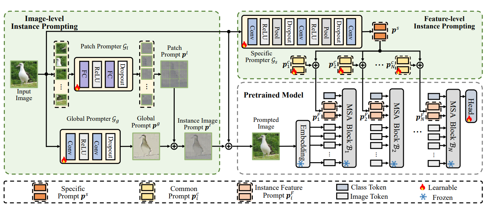
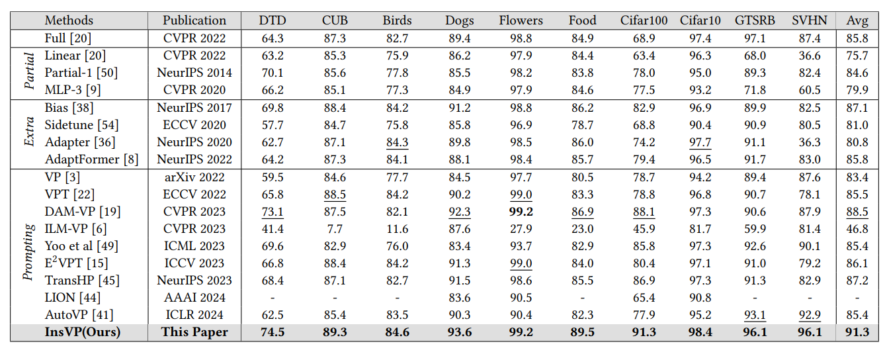
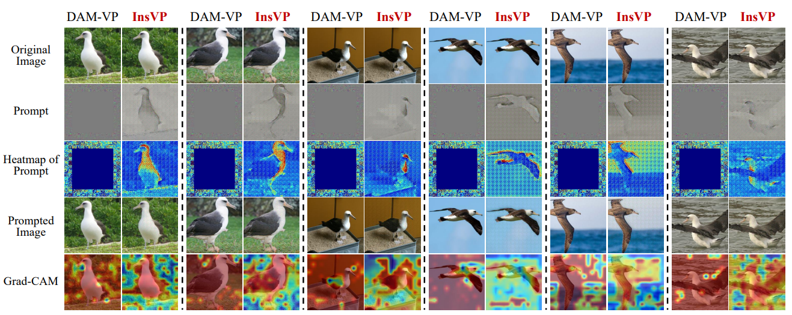

### Introduction
This is the *official* repository of our ACM MM 2024 paper "InsVP: Efficient Instance Visual Prompting from Image Itself". 

For more details, please check out our [paper](https://openreview.net/forum?id=OTjo1q8rWL).




### Environment
This code is based on pytorch2.4.0, pytorch-cuda11.8, timm 1.0.8 and torchvision 0.19.0.

For a complete configuration environment, see environment.yaml

### Data and Model Preparation

We follow [DAM-VP](https://github.com/shikiw/DAM-VP) and use the HTA benchmark for experiments. Among them, CUB, Birds, Dogs, and Flowers can be downloaded in [VPT repo](https://github.com/KMnP/vpt), while the other datasets can be accessed through torchvision.


Then your data directory should be organized in the following format:

- **you_data_path**
  - *CUB*
  - *Birds*
  - *Dogs*
  - ···

The pre-trained model weights can be downloaded at [here](https://drive.google.com/file/d/1zvIqdml4KVArPuWspoHKU7a6e0uAunF8/view?usp=sharing).


### InsVP
Taking the dtd dataset as an example, you can run the following command:
```
python main.py --info="InstanceVPD" \
    --model=InstanceVPD  --output_path="./Output/${dataset}/ViT/imagenet22k/InsVP" \
    --n_epochs=100 --meta_net=19 --hid_dim=16 --prompt_patch=16 --pretrained=imagenet22k \
    --prompts_2_weight=2 --batch_size=64 --prompt_patch_2=11 --prompt_patch_22=25 --dataset=dtd \
    --lr=0.001 --scheduler=cosine --weight_decay=0.5 --optimizer=AdamW --loader=DAM-VP --transform=default \
    --deep_prompt_type=ours9 --deep_layer=12 --mixup=mixup --cutmix_alpha=1.0 --TP_kernel_1=7 \
    --TP_kernel_2=9 --TP_kernel_3=3 --p_len=16 --p_len_vpt=16 --trainer=ours --warmup_epochs=20 \
    --base_dir="your_data_path"
```
Or you can directly run the pre-written shell script:
```
chmod +x ./sh/dtd.sh
bash ./sh/dtd.sh
```

### Results
The following results were obtained with a single NVIDIA 4090 GPU.

The comparison results against state-of-the-art methods on ten datasets (HTA benchmark). Partial, Extra, and Prompting represent partial tuning-based, extra module-based, and prompt learning-based parameter-efficient finetuning methods respectively. Following their paper, ILM-VP, Yoo et al and AutoVP utilize ResNeXt-101-32x8d, MoCo v3 trained ViT-B/16 and CLIP as the backbone respectively. The best results are bolded and the second-best results are underlined.




Visualization results of various instance samples in CUB. We present the original images along with the prompts of DAM-VP and our InsVP for the instances. Moreover, the heatmaps of the prompts, the prompted image, and the corresponding Grad-CAM visualization results are also presented.





Visualization of the generated instance image prompt $\boldsymbol{p}^I$, global prompt $\boldsymbol{p}^g$, and patch prompt $\boldsymbol{p}^l$ through our InsVP method. The image prompt $\boldsymbol{p}^I$ is derived by adding the global prompt $\boldsymbol{p}^g$ and the patch prompt $\boldsymbol{p}^l$ together.


<div style="text-align: center;">
    
</div>


### Citation
If you find this code useful for your research, please cite our paper.
```
@inproceedings{
    liu2024insvp,
    title={Ins{VP}: Efficient Instance Visual Prompting from Image Itself},
    author={Zichen Liu and Yuxin Peng and Jiahuan Zhou},
    booktitle={ACM Multimedia 2024},
    year={2024},
    url={https://openreview.net/forum?id=OTjo1q8rWL}
}
```


### Acknowledgement
Our code is partially based on the PyTorch implementation of [DAM-VP](https://github.com/shikiw/DAM-VP), [E2VPT](https://github.com/ChengHan111/E2VPT) and [VPT](https://github.com/KMnP/vpt). Thanks for their impressive works!

### Contact
For any questions, feel free to contact us ([lzc20180720@stu.pku.edu.cn](lzc20180720@stu.pku.edu.cn)).

Welcome to our [Laboratory Homepage](http://39.108.48.32/mipl/home/) and [OV<sup>3</sup> Lab](https://zhoujiahuan1991.github.io/) for more information about our papers, source codes, and datasets.